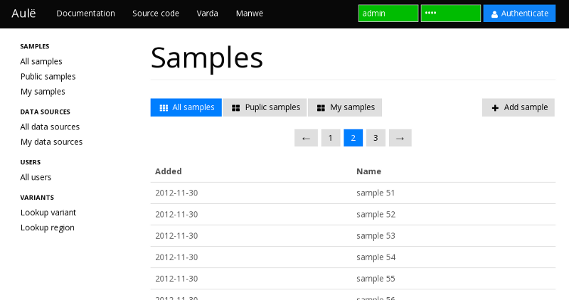

Aulë
====

A web interface to the [Varda](https://github.com/vara/varda) database for
genomic variation frequencies.

Implementation
--------------

Aulë is a client-side JavaScript-driven interface implemented in
[CoffeeScript](http://coffeescript.org/) on top of the
[Sammy.js](http://sammyjs.org/) framework and can be served entirely as
static files. [webpack](https://webpack.github.io/) is used for module
bundling and [Handlebars](http://handlebarsjs.com/) for templates.

The HTML5 layout is based on Twitter's
[Bootstrap](http://twitter.github.com/bootstrap/) with the
[Bootswatch Mono](http://bootswatch.com/cosmo/) theme and uses
[Less](http://lesscss.org/)
stylesheets. [Font Awesome](http://fortawesome.github.io/Font-Awesome/) is
used for icons.

Eh, yeah, this means a somewhat modern browser is needed. Tested with Chrome
26 and Firefox 10, both on Linux.

Development
-----------

A somewhat recent [Node.js](https://nodejs.org/) installation is required
(5.5.0 tested). Install package dependencies with NPM:

    npm install

A live-reloading development webserver servers the compiled application when
running:

    npm run dev

Since communication between Aulë and Varda will be subject to the
[Same origin policy](http://en.wikipedia.org/wiki/Same_origin_policy), Varda
should be
[configured to enable CORS](https://varda.readthedocs.org/en/latest/config.html#http-server-settings).

Deployment
----------

To compile the application to a bundle that can be served by any webserver,
install the package dependencies as above and run:

    npm run dist

The bundle and accompanying files can now be found in the `dist`
subdirectory.

Alternatively, pre-compiled bundles can be found from the
[GitHub releases page](https://github.com/varda/aule/releases).

Automated configuration and deployment of a server running Varda and Aulë is
available in the
[Ansible role for Varda](https://github.com/varda/ansible-role-varda/).

Configuration
-------------

Aulë looks for its configuration in a global object `AULE_CONFIG`. See the
`config.js` file for documentation on this.

The `index.html` in this repository includes the default `AULE_CONFIG` from
`config.js`. Please modify this file to your needs.

Dependency management
---------------------

In order to have somewhat reproducible builds, we use
[npm shrinkwrap](https://docs.npmjs.com/cli/shrinkwrap) to lock down all
dependencies. To add or update a dependency, run:

    npm install --save --save-exact some-dependency@some-version

Or, if it's a dev dependency:

    npm install --save-dev --save-exact some-dev-dependency@some-version

Then update the shrinkwrap:

    npm shrinkwrap --dev

Copyright
---------

Manwë is licensed under the MIT License, see the LICENSE file for details. See
the AUTHORS file for a list of authors.
